# TextAnalyser Business Process Analysis

**Date:** 2026-07-18  
**Version:** 1.0  
**Status:** Active  

---

## Executive Summary

TextAnalyser is a code quality analysis platform that automates Java code convention validation for enterprise projects. This document analyzes the key business processes, workflows, and decision flows that enable organizations to maintain consistent code quality standards across multiple projects.

**Key Business Value:**
- Automated code quality enforcement (eliminates manual reviews)
- Multi-project analysis without code changes (configuration-driven)
- Transparent metrics for compliance tracking
- Efficient legacy project modernization (encoding support)

---

## Business Process Overview

### Process Landscape

```
┌─────────────────────────────────────────────────────────────────┐
│                      TextAnalyser Platform                      │
├─────────────────────────────────────────────────────────────────┤
│                                                                   │
│  ┌──────────────────┐    ┌──────────────────┐                  │
│  │ Analysis Setup   │───▶│ Code Analysis    │                  │
│  │ (Configuration)  │    │ (Validation)     │                  │
│  └──────────────────┘    └────────┬─────────┘                  │
│                                   │                             │
│                          ┌────────▼──────────┐                 │
│                          │ Report Generation │                 │
│                          │ (CSV & Markdown)  │                 │
│                          └────────┬──────────┘                 │
│                                   │                             │
│                          ┌────────▼──────────┐                 │
│                          │ Quality Review    │                 │
│                          │ (Stakeholder Use) │                 │
│                          └───────────────────┘                 │
│                                                                   │
└─────────────────────────────────────────────────────────────────┘
```

---

## Process 1: Project Onboarding & Setup

### Workflow Diagram

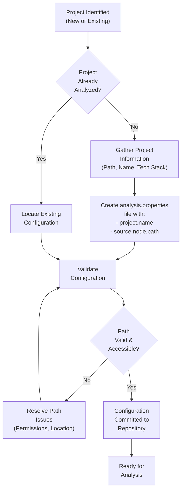

### Decision Points

| Decision | Condition | Action |
|----------|-----------|--------|
| **Path Type** | External project | Use absolute path |
| **Path Type** | Local project | Use relative path |
| **Override** | Config exists | Update existing |
| **Validation** | Path doesn't exist | Resolve or report error |

### Stakeholders

- **Data Owner:** Project manager / Technical lead
- **Executor:** DevOps / Build engineer
- **Verifier:** Quality assurance lead

### Success Criteria

- Configuration file created and validated
- Path points to valid Java source directory
- No naming conflicts with existing projects

---

## Process 2: Code Analysis Execution

### Workflow Diagram

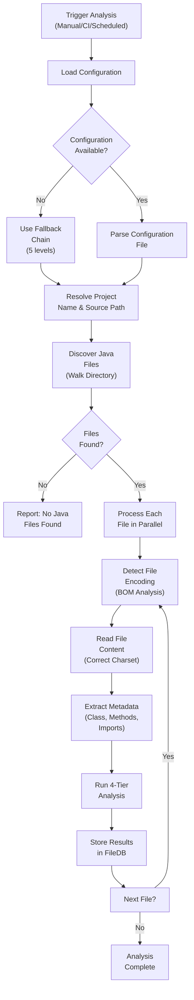

### 4-Tier Analysis Details

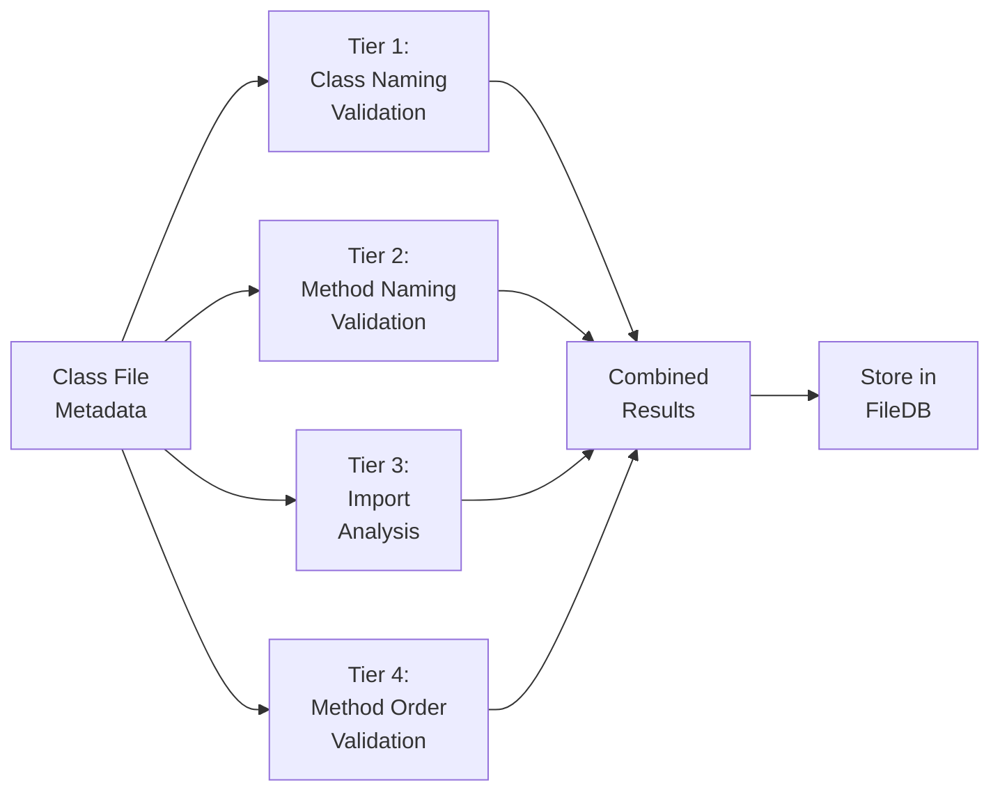

### Error Handling

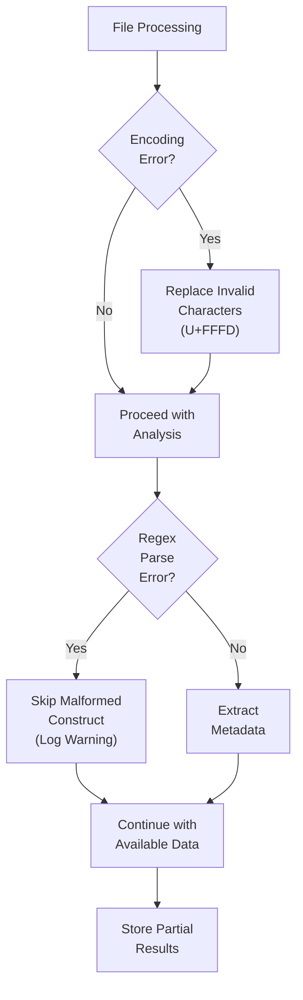

### Performance Characteristics

| Metric | Value | Notes |
|--------|-------|-------|
| **File Reading** | 64KB buffered | NIO channel processing |
| **Per-File Time** | 1-5ms | Depends on complexity |
| **Typical Project** | 200+ files in 2-5s | TextAnalyser: 16 files in <1s |
| **Bottleneck** | File I/O + Regex | Not linting rules |

---

## Process 3: Report Generation

### Workflow Diagram

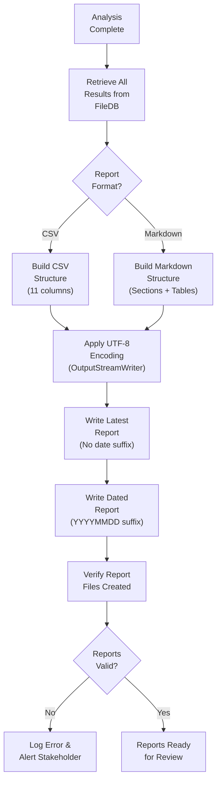

### Report Content Mapping

**CSV Export** → Machine-readable format
```
Columns: Full Name, Current Name, Suggested Name, Extends Class,
         Purpose, Validation, Lint Errors, Lint Warnings, 
         Lint Issues, Timestamp
Rows: One per analyzed class
```

**Markdown Export** → Human-readable format
```
Sections: Executive Summary, Key Metrics, Analysis Details,
          Violations Table, Remediation Guidance, Compliant Classes,
          Conclusion
```

### Report Naming Convention

```
Pattern: {project-name}-analysis-report[-YYYYMMDD].{csv|md}

Examples:
  textanalyser-analysis-report.csv
  textanalyser-analysis-report-20260718.csv
  gspos-analysis-report.md
  gspos-analysis-report-20260718.md
```

### Storage Strategy

| Report Type | Location | Purpose | Retention |
|-------------|----------|---------|-----------|
| **Latest** | analysis/name.format | Current state | Always overwritten |
| **Dated** | analysis/name-YYYYMMDD.format | Historical archive | Keep all |
| **Cache** | .analysis-db/ | Fast retrieval | Auto-managed |

---

## Process 4: Quality Review & Decision Making

### Stakeholder Workflow

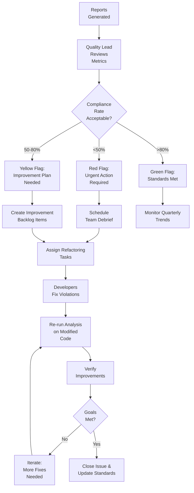

### Decision Criteria

| Compliance Rate | Action | Timeline | Owner |
|-----------------|--------|----------|-------|
| 0-40% | Halt new features, focus on refactoring | 2 weeks | Lead Dev |
| 40-60% | Parallel track refactoring with features | 4 weeks | Tech Lead |
| 60-80% | Normal development, gradual improvements | 8 weeks | Project Lead |
| 80-100% | Maintenance mode, prevent regression | Ongoing | QA Lead |

---

## Process 5: Project Switching

### Multi-Project Management

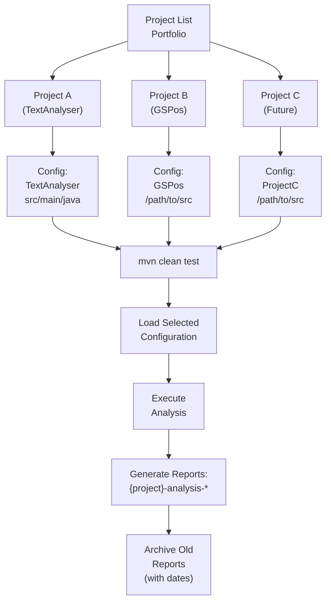

### Configuration Switching Workflow

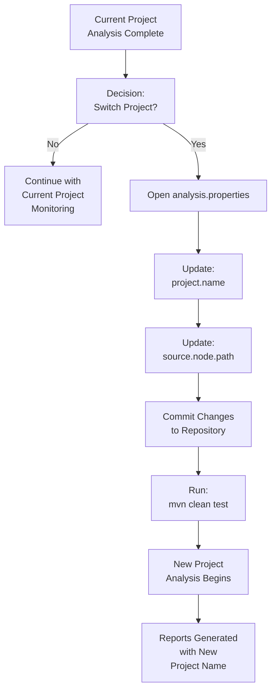

### Concurrent Project Support

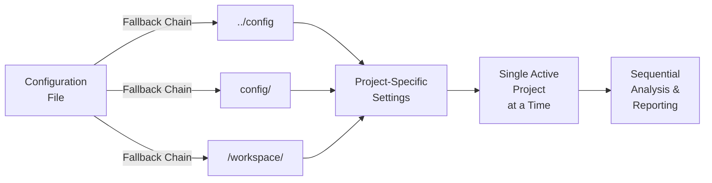

---

## Process 6: Continuous Improvement Cycle

### Quarterly Review Process

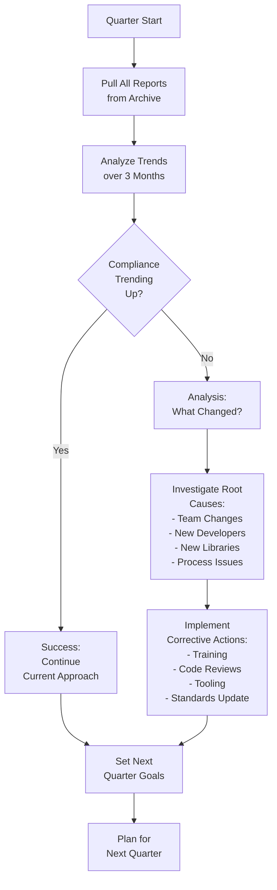

### Metrics Tracking

| Metric | Source | Frequency | Owner |
|--------|--------|-----------|-------|
| **Compliance Rate** | Latest report | Per run | QA |
| **Trend** | Dated reports | Monthly | Tech Lead |
| **Violations by Type** | CSV data | Per analysis | Dev Lead |
| **Critical Issues** | Red flags | Immediate | Lead Dev |

---

## Process 7: Incident Management

### Error Handling Process

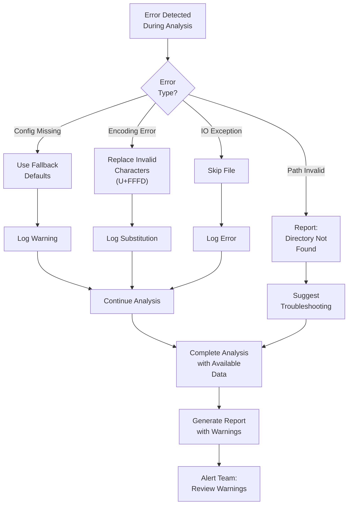

### Escalation Path

```
Level 1: Auto-log (File not found, encoding issue)
    ↓
Level 2: Team notification (>10% files skipped)
    ↓
Level 3: Lead notification (Analysis failed)
    ↓
Level 4: Infrastructure team (System issue)
```

---

## Process 8: Encoding Conversion for Legacy Code

### Legacy Project Modernization

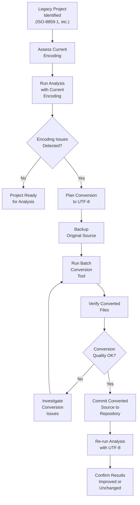

### Risk Mitigation

| Risk | Mitigation | Owner |
|------|-----------|-------|
| **Data Loss** | Backup original first | Ops |
| **Encoding Corruption** | Verify on sample files | QA |
| **Build Break** | Test on branch first | Dev |
| **Character Substitution** | Review diff carefully | Tech Lead |

---

## Performance & Scalability

### Analysis Performance Workflow

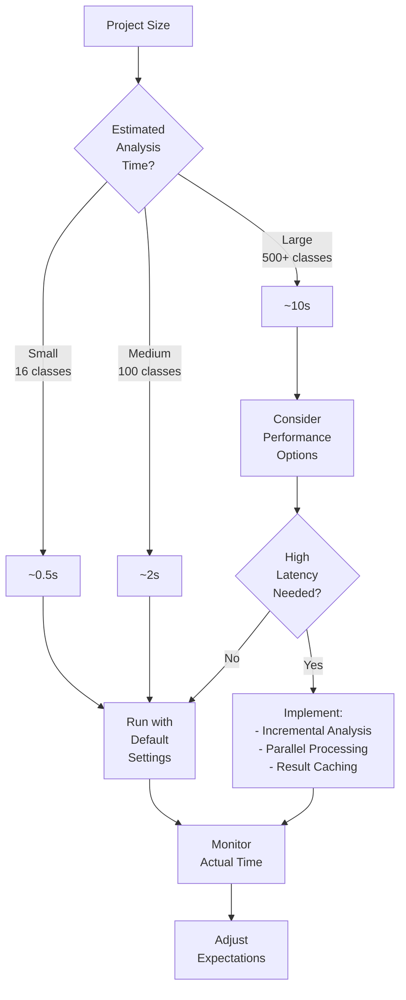

---

## Business Value Realization

### ROI Tracking

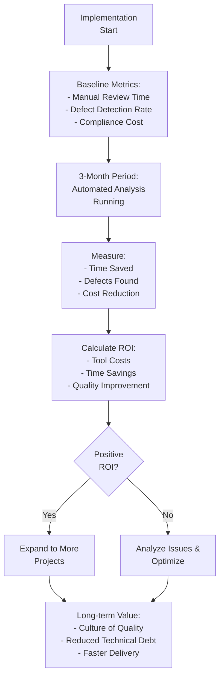

### Cost-Benefit Analysis

| Benefit | Quantification | Timeline |
|---------|---|----------|
| **Manual Review Elimination** | 40 hours/month saved | Month 1 |
| **Early Defect Detection** | 60% fewer code review issues | Month 2 |
| **Developer Training** | Self-service quality feedback | Month 1 |
| **Technical Debt Reduction** | 25% codebase improvement | Month 6 |
| **Compliance Automation** | 100% audit trail available | Ongoing |

---

## Risk Management

### Risk Register

| Risk | Probability | Impact | Mitigation |
|------|-------------|--------|-----------|
| **Configuration Error** | Medium | Low | Validation + fallback |
| **Encoding Corruption** | Low | High | BOM detection + testing |
| **Analysis Regression** | Low | Medium | Dated reports + trending |
| **Performance Degradation** | Low | Medium | Caching + monitoring |
| **Team Resistance** | Medium | High | Training + gradual rollout |

---

## Governance & Controls

### Change Management

```
Analysis Rule Change Request
    ↓
Impact Assessment
    ↓
Stakeholder Review (Dev + QA + Lead)
    ↓
Approval Decision
    ↓
Update Linting Rules
    ↓
Test on Sample Projects
    ↓
Roll Out to Production
    ↓
Monitor for Regressions
```

### Quality Gates

| Gate | Trigger | Action | Owner |
|------|---------|--------|-------|
| **Config Validation** | On startup | Fail if path invalid | Platform |
| **Encoding Error** | On read | Log + replace | Platform |
| **Analysis Completion** | On finish | Verify reports generated | QA |
| **Report Quality** | On export | Check for data loss | System |

---

## Future Process Enhancements

### Planned Improvements

1. **Auto-Fix Capability** (Q3 2026)
   - Automatic code correction
   - Developer review + approval
   - Track fix success rate

2. **IDE Integration** (Q4 2026)
   - Real-time feedback in editor
   - One-click violation fixing
   - Developer experience improvement

3. **CI/CD Pipeline** (Q4 2026)
   - Automated analysis on commit
   - Fail build on critical violations
   - Dashboard integration

4. **Historical Analytics** (Q1 2027)
   - Trend reporting
   - Predictive modeling
   - Team productivity metrics

---

## Document History

| Date | Version | Author | Change |
|------|---------|--------|--------|
| 2026-07-18 | 1.0 | System | Initial creation |

---

## Approval & Sign-Off

**Document Owner:** Technical Architecture  
**Review Date:** 2026-07-18  
**Status:** Active  
**Next Review:** 2026-10-18  

**Stakeholder Approvals:**
- [ ] Technical Lead
- [ ] Quality Assurance
- [ ] Project Manager
- [ ] Operations

---

**End of Business Process Analysis Document**

